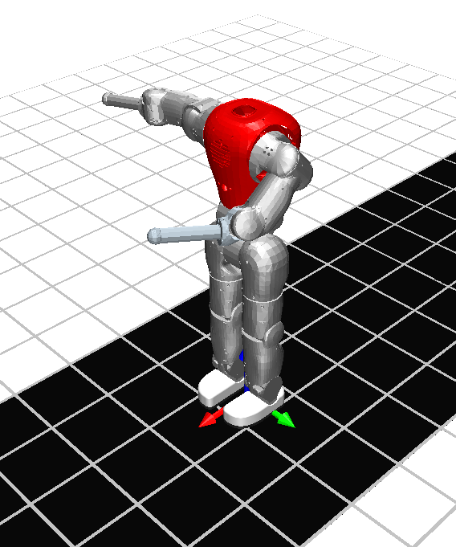

Read me first !
===============

There are three possibilities to use this simulator:
* Matlab
* Simulink (C)
* Standalone (C/C++)

Matlab version
--------------

This version uses only [Matlab](http://www.mathworks.nl/products/matlab/) files. More information is available on the [robotran website](http://www.robotran.be/), with the following tutorial: [Robotran modeling features](http://www.robotran.be/downloads/tutorial/RobotranLearning_ModelingFeatures.pdf).

No compilation is required for this version. This version is compatible with any computer, provided Matlab is installed (release R2007a or later).
However, this version is the slowest one.

Simulink version (C/C++)
--------------------

This version uses [Simulink](http://www.mathworks.nl/products/simulink/) to compile a C project. So, it is still possible to use some modules coming from Matlab.

C files must be compiled with a [Mex](http://www.mathworks.nl/help/matlab/matlab_external/introducing-mex-files.html) compiler. Thanks to the C code, this version is much faster than the Matlab one (there might be a factor 100 for the execution time). This version can also be extended with C++ code.

Provided Matlab and a Mex compiler are installed, this version can run on the three OS (Linux, Mac OS and Windows), both for the 32-bit and the 64-bit versions.
For more information, consult the [README.md](workR/Simulink/README.md) located in the __workR/Simulink__ folder.

Standalone version (C/C++)
--------------------------

This version is a standalone one in the sense that it does not require Matlab nor Simulink to run. It can be seen as a C function running without resorting to other programs. Nevertheless, some libraries (like [SDL](http://www.libsdl.org/)) are used to add new features. The most important one is its ability to run the simulation in real-time, while allowing the user to interact with it and analyzing results on graphs plotted in real-time.

This version only uses C files but can be extended with C++ code. It uses [CMake](http://www.cmake.org/) to generate projects on any of the three OS (Linux, Mac OS and Windows) with different IDEs ([Visual Studio](http://www.visualstudio.com/), [Code::Blocks](http://www.codeblocks.org/), [XCode](https://developer.apple.com/xcode/)...) or with [Makefiles](http://mrbook.org/tutorials/make/) projects. Nevertheless, this version requires using a 64-bit OS and may have some problems with the real-time visualization on Mac OS. Therefore, we advise to use this version with Linux or Windows 64-bit.

This version requires to compile the project, but is the fastest one (slightly fatster than the Simulink version because there is no link with Simulink-Matlab). For more information, consult the [README.md](StandaloneC/README.md) located in the __StandaloneC__ folder.

Project specific features
-------------------------

This project is a simulation environment for the [COMAN robot](http://www.iit.it/en/advr-labs/humanoids-a-human-centred-mechatronics/advr-humanoids-projects/compliant-humanoid-platform-coman.html). This robot has 23 actuated DOFs (with [SEA](http://www.iit.it/en/advr-labs/humanoids-a-human-centred-mechatronics/advr-humanoids-projects/series-elastic-actuators-seas.html)). There are different versions of the COMAN:

* _Basic version_: COMAN with 23 actuated DOFs (+ 6 DOFs for the floating base) and initial rounded rigid feet
* _Short feet_: Basic version where the initial rounded rigid feet are replaced by shorter (14 cm long instead of 19 cm) rectangular rigid feet
* _Compliant feet_: Basic version where the rigid feet are replaced by comliant feet made of two rigid plates connected by a spring
* _Long arms_: Short feet version, with long arms ans hands 
* _SkyWalker_: Basic version, but the COMAN is hung, so that it does not walk on the ground but in the sky...

Some of these versions have two sub-models:

* _2D walking_: waist of the COMAN is constrained to stay in the world sagittal plane (3 DOFs of the waist are constrained to 0: lateral motion, roll and yaw)
* _3D walking_: COMAN is totally free (6 DOFs for the waist)

All these versions are stored in _StandaloneC/src/other/CoMan_versions_. These are the files stored in this folder:

* _.mbs file_
* _.mbsdata file_
* _symbolic files_ generated by Robotran

Consequently, this Git version does not save these files outside the _CoMan_versions_ folder. To get them back, you must copy-paste them to their correct location, or run CMake.
For the Simulink version, you must also modify the flags at the beginning of the matlab file ' _compile_c_files.m_ ', located in _workR/Simulink_.

The current state of the controller allows position or torque tracking for all the joints. The references are updated in the [get_ref.c](StandaloneC/src/project/controller_files/get_ref.c) file. For instance, torque references need to be updated in _ovs->Qq_ref[i]_ and are activated with this line: _ovs->imp_ctrl_index[i] = QQ_REF_TRACKING;_. The joint index _i_ depends on a list presented int the [controller_def.h](StandaloneC/src/project/controller_files/controller_def.h) file.

Positions and torques low-level controller is implemented in the [impedance_controller.c](StandaloneC/src/project/simulation_files/impedance_controller.c) file. While its purpose is to reproduce the low-level controller on the real COMAN, the gains and rules are not exactly the same. Consequently, this file could be improved. At the end, the voltage _uvs->Voltage[i]_ sent to each motor _i_ is computed and converted in a controller reference called _uvs->Control[i]_ (with torque units) in the [controller_outputs.c](StandaloneC/src/project/interface_controller/controller_outputs.c) file.

Joints models are then integrated (with _uvs->Control[i]_) in the [user_Derivative.c](StandaloneC/src/project/user_files/user_Derivative.c) file, producing joint torques in the [user_JointForces.c](StandaloneC/src/project/user_files/user_JointForces.c) file. The joint torques _MBSdata->Qq[i]_ are the ones Robotran is using to compute the dynamical equations. Their indexes _i_ are not the same as the ones of _ovs->imp_ctrl_index[i]'_: they correspond to the list available in the [simu_def.h](StandaloneC/src/project/simulation_files/simu_def.h) file.

The files in the [controller_files](StandaloneC/src/project/controller_files) folder do not have access to all the data from Robotran. This is done on purpose, so that the controller only has inputs available on the real COMAN. Then, transferring the controller to the real hardware is straightforward. These inputs are defined in the [controller_inputs.c](StandaloneC/src/project/interface_controller/controller_inputs.c) file.

