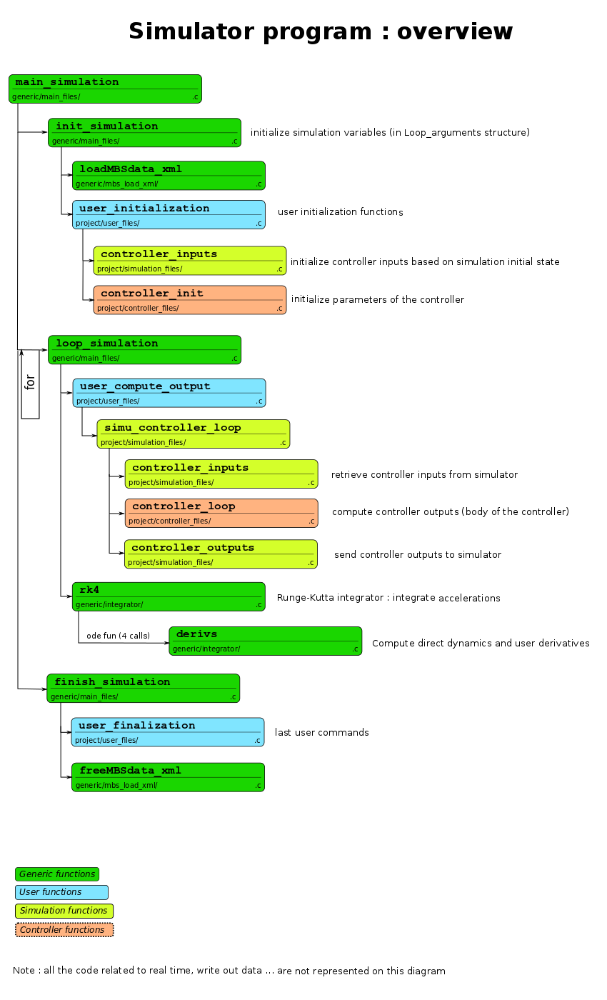

Standalone version
==================

--- Installation ---
--------------------

The installation instructions are fully described for Linux and Windows 64 bit. Some hints are also provided for the Mac Os version (installation on a Mac is very similar to the Linux one, as both are Unix systems). This Standalone version was not tested with 32-bit Os versions (but it should be possible to use it with these versions, even if it is not trivial). Nevertheless, it is better to use it with 64-bit versions of Linux or Windows. Otherwise, the [Simulink version](workR/Simulink/README.md) might be more suited.

Unlike the Matlab or Simulink versions, the project folder can be located anywhere, except if you use _vrml_ files (.wrl located in _animationR/vrml_). In this case, you must install Robotran (not compulsory, otherwise) and the project folder must be located in your Robotran project folder (defined during the [Robotran installation](http://www.robotran.be/download)). In any case, avoid placing the project folder in places where the path contains some spaces as it might generate some problems with [CMake](http://www.cmake.org/) (see below).

## - Linux - ##

For the Linux installation, examples of Terminal lines are provided for Ubuntu. Using the same lines should work on your computer for most of them. Nevertheless, you might have to adapt them, depending on your computer configuration and on the external program versions available.

### CMake: create the project ###

Install [CMake](http://www.cmake.org/) to be able to generate the project from the _CMakeLists.txt_ files.

* _sudo apt-get install cmake_
* _sudo apt-get install cmake-curses-gui_ (if you prefer the gui interface)

### Compiler ###

If you want to install another compiler (e.g. _gcc-4.4_). The _gcc_ compiler should already be installed and is enough to compile the code. Nevertheless, other compilers (like _gcc-4.4_) are faster to compile the code.

* _sudo apt-get install gcc-4.4_
* _sudo apt-get install g++-4.4_

### Libxml: read the xml files ###

Install [Libxml2](http://xmlsoft.org/) to read the _xml_ files used to initialize the simulation data.

* _sudo apt-get install libxml2-dev_

### SDL 2.0: Graphs and interactions with the simulator (in real-time) ###

Download [SDL 2.0](http://www.libsdl.org/). For instance, you can use this [link](http://www.libsdl.org/download-2.0.php) and download _SDL2-2.0.2.tar.gz_.

Install it with [CMake](http://www.cmake.org/).

* _cd SDL2-2.0.2_
* _mkdir build_
* _cd build_
* _cmake .._
* _make_
* _sudo make install_

Alternative: install it with the following lines:

* _cd SDL2-2.0.2_
* _./configure_
* _make_
* _sudo make install_

Install [freetype](http://www.freetype.org/) (possibly with package _libfreetype6_).

* _sudo apt-get install freetype*_

Later, if you get the following error: " _fatal error: GL/gl.h: No such file or directory_ ", you might need to run this command: " _sudo apt-get install freeglut3-dev_ ".

Download _SDL2_ttf_. For instance, you can use this [link](https://www.libsdl.org/projects/SDL_ttf/) and download _SDL2_ttf-2.0.12.tar.gz_.

Install _SDL2_ttf_.

* _cd SDL2_ttf-2.0.12_
* ./configure
* _make_
* _sudo make install_

### Java for the real-time visualization ###

Download _Java SE Development Kit 7_. For instance, follow this [link](http://www.oracle.com/technetwork/java/javase/downloads/jdk7-downloads-1880260.html) and download _jdk-7u51-linux-x64.tar.gz_.

Copy the include folder containing _jni.h_ into _usr/lib/jvm/java-7-openjdk-amd64_ (or equivalent) -> download [Open JDK](http://openjdk.java.net/) if not installed yet.

* _sudo cp -r jdk1.7.0_45/include/ /usr/lib/jvm/java-7-openjdk-amd64/_

Copy the _lib_ folder into _usr/lib/jvm/java-7-openjdk-amd64/jre_ (or equivalent).

* _sudo cp -r jdk1.7.0_45/jre/lib/ /usr/lib/jvm/java-7-openjdk-amd64/jre/_

Download _Java 3D_. For instance, you can use this [link](https://java3d.java.net/binary-builds.html) and download _j3d-1_5_2-linux-amd64.zip_.

Unzip _j3d-jre.zip_ to get the _lib_ folder

Copy _libj3dcore-ogl.so_ into _usr/lib/jvm/java-7-openjdk-amd64/jre/bin_ (or equivalent).

* _sudo cp j3d-1_5_2-linux-amd64/lib/amd64/libj3dcore-ogl.so /usr/lib/jvm/java-7-openjdk-amd64/jre/bin/_

## - Windows - ##

This Standalone version is currently only configured for 64-bit machines.

It should still be possible to use it with 32-bit machines if you replace the files 
located in _src/other/win64_include_lib_ (which are 64-bit machine files) by the corresponding 32-bit ones.

Some useful links for the 32-bit version and the corresponding files to download (skip this if you have a 64-bit version of Windows):
* [libxml](http://www.xmlsoft.org/downloads.html): libxml2.dll, libxml include folder, libxml2 object file library, also use this [link](http://gnuwin32.sourceforge.net/packages/libiconv.htm) to get iconv.h, iconv object file library
* [SDL 2.0](http://www.libsdl.org/download-2.0.php): SDL2.dll, SDL include folder, SDL2 object file library, SDL2test object file library, SDL2main object file library
* [SDL2_ttf](http://www.libsdl.org/projects/SDL_ttf/): libfreetype-6.dll, SDL2_ttf.dll, zlib1.dll, SDL_ttf.h, SDL2ttf object file library

### CMake: create the project ###

Download CMake [here](http://www.cmake.org/cmake/resources/software.html).

Run the _cmake-2.8.12.2-win32-x86.exe_ executable (it also works for 64-bit machines).

### Libxml and SDL 2.0 ###

All the needed files are already located in src/other/win64_include_lib/ for the 64-bit machines (so, you do not have to install them).
For the 32-bit ones, replace these files with the corresponding 32-bit ones (see above).

### Java for the real-time visualization ###

Download _Java SE Development Kit 7_ and install it. For instance, use this [link](http://www.oracle.com/technetwork/java/javase/downloads/jdk7-downloads-1880260.html) and download _jdk-7u51-windows-x64.exe_.

Download _Java Virtual Machine_. You can use this [link](http://java.com/fr/download/index.jsp).

Download and install _Java 3D_. For instance, use this [link](https://java3d.java.net/binary-builds.html) and download _j3d-1_5_2-windows-amd64.exe_.

_j3dcore-ogl.dll_ should be installed (usually located in _C:/Program\ Files/Java/jdk1.7.0_51/jre/bin_). 
If it is not the case, you can find it with this [link](https://java3d.java.net/binary-builds.html) if you download _j3d-1_5_2-windows-amd64.zip_ (or equivalent).
Copy the _j3dcore-ogl.dll_ in C:/Program\ Files/Java/jdk1.7.0_51/jre/bin (or similar).

You must modify the environment variable called _Path_ to add the location of the _jvm.dll_ file (usually in 'C:Program\ Files/Java/jdk1.7.0_51/jre/bin/server').
Locate this file (jvm.dll) and copy its location. 
This is the path to access the _jvm.dll_ file. You must add it to the _Path_ environment variable. Here is the procedure:

Go to _Control Panel/All Control Panels/Systems_ and click on _Modify Settings_. 
In _Advanced System Settings_, click on _Environment Variables..._
In _System Variables_, click on the _Path_ variable, then _Modify..._
At the end of the second field, put a ';' and paste the location of your _jvm.dll_ file.

## - Mac Os - ##

Installation on an Apple machine is very similar to the Linux one as both are Unix systems.
Nevertheless, there are currently some problems with the Java real-time visualization. So, it might be better to avoid
using the real-time features on a Mac. So, it is not necessary to install _SDL 2.0_, _SDL ttf_ and _Java_ for real time visualization.

When using _CMake_, set the flag _FLAG_REAL_TIME_ to _off_ and the flag _FLAG_WRITE_OUTPUT_FILES_ to _ON_ (see below).

--- Project overview ---
------------------------

Have a look at the [Simulink instructions](workR/Simulink/README.md), in the _Project overview_ section. All the folders and the files described there are also used by the Standalone version (except some files in _workR/Simulink_).

On top of that, some other files located in the _StandaloneC_ folder are only used by the Standalone version:

* All _CMakeLists.txt_ files are used by [CMake](http://www.cmake.org/) to generate the project. If you are not familiar with CMake, do not modify these files.
* All the sources (except the symbolic files) are located in the __StandaloneC/src__ folder:
	* __generic folder__: generic files used by all the projects, do not modify these files. For information, here is the content of the different folders:
		* __integrator__: fixed time and variable time step integrators.
		* __jni__: [Java Native Interface](http://docs.oracle.com/javase/6/docs/technotes/guides/jni/) used for the real-time Java visualization.
		* __main_files__: main files of the project (init, _loop_, _finish_), including the _main()_ in _model_main.c_.
		* __mbs_load_xml__: files used to load the data from the .mbsdata xml file.
		* __real_time__: real-time constraints during the simulation.
		* __robotran__: [Robotran](http://www.robotran.be/) functions, as the ones installed by Robotran in _MBsysLab/mbs_simulink/mbs_sourceC_ for the Simulink version.
		* __sdl__: SDL2.0 used to plot graphs during the simulation (or in post-process, see this [file](StandaloneC/src/other/save_vector/README.md)) and to let the user interact in real-time with the simulation.
		* __post_process__: files written to be analyzed in post-process.
		* __Simbody__: contact forces computed as external forces with [Simbody](StandaloneC/src/project/simulation_files/Simbody/README.md).
		* __useful__: some useful functions, like vectors creation. 
	* __project folder__: files dependent on the project. Normally, the user only modifies these files.
		* __controller_files__, __interface_controller__, __simulation_files__ and __user_files__: same folders as the ones explained in the [Simulink instructions](workR/Simulink/README.md).
		* __project_files__: files used to configure the Standalone project:
			* __info_project.h__: project main configurations (simulation time, time step...).
			* __events_config.c__: configure the keyboard, mouse and joystick inputs with SDL2.0.
			* __plot_config.c__: configure the curves plotted in real-time.
			* __save_vectors_config.c__: configure the vectors saved to be analyzed in post-process.
		* __varState__: _control_variables.txt_ and _simu_variables.txt_ are the equivalent of _control_variables.m_ and _simu_variables.m_, read the [Simulink instructions](workR/Simulink/README.md) for more information. Do not modify the _update_check_ folder.
		* __Model_standalone.mbsdata__: xml file created from the first xml file with the extension .mbs (located in _dataR_), see below for more information.
	* __other folder__: all other files needed. Normaly, the user should avoid modifying these files.
		* __conf__: configuration files used by [CMake](http://www.cmake.org/) to get the path to the external libraries needed.
		* __mbsyspad__: files used for the real-time Java visualization.	
		* __save_vector__: vectors saved during the simulation to be analyzed in post-process (see this [file](StandaloneC/src/other/save_vector/README.md)).
		* __varState__: source files used to automatically generate _user_sf_IO.c_, _ControllersStruct.c_ and their corrsponding headers (see this [file](StandaloneC/src/other/varState/synchronize/README.md)).
		* __win64_include_lib__: _dll_, _include_ and _lib_ files for the external libraries used with Windows.
		* __CoMan_versions__: different versions of the CoMan: rigid feet, compliant feet, hung... (specific to the CoMan project).

--- Project creation ---
------------------------

Have a look at the [Simulink instructions](workR/Simulink/README.md), in the _Project creation_ section. The creation of a project is very similar in bot cases (Simulink and Standalone). On top of that, it might be easier to first create and test a project using the Simulink approach. When you get a satisfactory result with the Simulink environment, it is very easy and fast to adapt it to the Standalone version. However, it is still possible to directly create the project for the Standalone version. This section describes the differences with the Simulink version.

The sections _Compiling the code_, _Simulink diagram_ and _Lanching the simulation_ in the [Simulink instructions](workR/Simulink/README.md) only correspond to a Simulink projetc and are useless for a Standalone project. 

### Multibody equations ###

No change with regard to the [Simulink instructions](workR/Simulink/README.md).

### userfctR ###

No change with regard to the [Simulink instructions](workR/Simulink/README.md). Even if the _Standalone_ version does not use Matlab during the execution, the Standalone project creation requires to create an _xml_ file called _Model_standalone.mbsdata_ where the coordinate partitioning is already done. This xml file is created with Matlab. This is the only use of Matlab for the _Standalone_ version. You only have to generate it once. Then, as long as you do not change the .mbs file located in _dataR_, you do not have to use Matlab. See below how you can generate it with the files _generate_mbs_data.m_ and _synchronize_versions.m_ located in the _workR/Simulink_ folder.

### workR/Simulink ###

Have a look at the [Simulink instructions](workR/Simulink/README.md). However, there are some changes relative to the Simulink project:

* __generate_mbs_data.m__: no change with regard to Simulink. This file will be used to generate _Model_standalone.mbsdata_.
* __simu_variables.m__ and __control_variables.m__: these files are useless for the Standalone project. Indeed, you must confgure their equivalent .txt files (simu_variables.txt and _control_variables.txt_) located in _StandaloneC/src/project/varState_. However, if some people are working on the Simulink version, while others are working with the Standalone version, it is still possible to synchronize these files. To synchronyze the _Standalone_ files from the _Simulink_ ones, launch the script _synchronize_versions.m_ with _stand_state_flag_ set to 1. To synchronyze the _Simulink_ files from the _Standalone_ ones, go to _StandaloneC/src/other/varState/synchronize_ and consult the corresponding [README.md](StandaloneC/src/other/varState/synchronize/README.md).
* __compile_c_files.m__ and __call_simulink.m__: useless for the Standalone version.
* __synchronize_versions.m__: use this script to synchronyze the Standalone _simu_variables.txt_ and _control_variables.txt_ files from the _Simulink_ ones (set _stand_state_flag_ to 1) and to generate the _Model_standalone.mbsdata_ file (set _xml_flag_ to 1).

### StandaloneC/src/project ###

Have a look at the [Simulink instructions](workR/Simulink/README.md). All explanations provided there are also correct for the Standalone version. However, some additional files are only used by the Standalone version. Normally, you only have to modify the files located in __StandaloneC/src/project__. So, explanations are only provided for the folders located in _StandaloneC/src/project_.

* __controller_files__, __interface_controller__, __simulation_files__ and __user_files__ folders: no change with regard to Simulink.
* __Model_standalone.mbsdata__: automatically generated by _synchronize_versions.m_ in the _workR/Simulink_ folder (see above). You do not have to modify it. 
* __varState__: modify the files _simu_variables.txt_ and _control_variables.txt_ and do not open the _update_check_ folder. More information is provided for their equivalent Matlab files (have a look at the [Simulink instructions](workR/Simulink/README.md), in the _workR/Simulink_ subsection).
* __project_files__: files used to configure the Standalone version:
	* __info_project.h__: define the project properties, the simulation time and other features related to the real-time aspects. Consult the comments provided in this header file to have more information.
	* __plot_config.c__: define the curves to plot in real-time in this file. All the needed instructions are in the comments of this file. MBSdata is provided, so you should have access to nearly all the simulation variables, including the ones of an optional controller. You can modify the code in the ASSIGN VALUES FOR THE CURVES and CURVES DEFINITION sections.
	* __events_config.c__: configure the actions related to the use of a keyboard or a joystick during the simulation running in real-time. There are 3 sections indicated with MODIFICATIONS HERE (one for the joystick axes, one for the joystick buttons and one for the keyboard keys). You can adapt the code of these sections to your own need (instructions are provided in this file). Avoid modifying the other parts of the file.
	* __save_vectors_configs.c__: define the variables to save in a .txt file to be analyzed in post-process (by this simulator, Matlab...). You can modify the TO MODIFY section. Additional information is provided in the comments of this file. To analyze the vectors in post-process using this simulator, go to the _StandaloneC/src/other/save_vector_ folder and read the corresponding [README.md](StandaloneC/src/other/save_vector/README.md).

### Preparing the controller designed in simulation for a real robot ###

No change with regard to the [Simulink instructions](workR/Simulink/README.md).

--- Creating the project with CMake ---
---------------------------------------

[CMake](http://www.cmake.org/) is used to generate projects on any of the three OS (Linux, Mac OS and Windows) with different IDEs ([Visual Studio](http://www.visualstudio.com/), [Code::Blocks](http://www.codeblocks.org/), [XCode](https://developer.apple.com/xcode/)...) or with [Makefiles](http://mrbook.org/tutorials/make/) projects. We now distinguish two different folders: the _source folder_ and the _build folder_. The _source folder_ is your project folder containing all the other folders you used: _dataR_, _symbolicR_, _StandaloneC_... The _build folder_ contains the binaries of your project (see next paragraph).

The _build folder_ will be created by CMake anywhere on your computer: you define its location (it can even be located inside the _project folder_). However, it is better to avoid placing this folder in places where there is a space in the path. You will compile and execute your project from the build folder. However, the files used by the build folder are the ones located in the source folder. The build folder has only links to the source files (it does not make any copy). Consequently, modifying the source code from an IDE project created with CMake in the build folder will directly impact the files located in the source folder.

You can use CMake with a Unix terminal (Linux and Mac OS) or with a graphical interface (Windows, Linux and Mac OS).

### Using a Unix Terminal (Linux and Mac OS) ###

Examples of Unix Terminal lines are provided. In this example, we decided to place the _build folder_ at the root of the _StandaloneC_ folder.

* _cd StandaloneC_
* _mkdir build_ (or any other name you choose for the build folder)
* _cd build_
* _cmake_ .. (You must point to the file called _CMakeLists.txt_ and located at the root of the _StandaloneC_ folder, so you should use 'cmake ../..' if the build folder location was _StandaloneC/exampleFolder/build_)

Then, the project is already created, but you used the default flags configuration (see the subsection _CMake Flags_ for more information). If you want to modify these flags, use the following lines:

* _cd StandaloneC_
* _mkdir build_ 
* _cd build_
* _ccmake_ .. ('ccmake' and not 'cmake', with two 'c' !!!)
* _c_ (to configure)
* _e_ (to exit help)
* modify the flags according to your needs with the _Enter_ key
* _c_ (to configure with the new flags)
* _e_ (to exit help)
* _g_ (to generate and exit)

According to the flags defined with _ccmake_, some external libraries are also required to compile the project. You get this information after running the command _cmake_ or after pressing on the _c_ key when using _ccmake_. Refer to the subsection _External Libraries_ (see below).

At the end, a Makefile project is generated.

### Using a graphical interface (Windows, Linux and Mac OS) ###

Launch CMake

Indicate where the source code is located (the location of the first _CMakeLists.txt_, i.e. at the root of the _StandaloneC_ folder).
Indicate the path where your project will be created (where to build the binaries), i.e. the _build_ folder (you can give another name).
Click on the _Configure_ button.
Choose your generator (an IDE or a Makefile project).

On Windows, using [Visual Studio Express](http://www.visualstudio.com/en-us/products/visual-studio-express-vs.aspx) is a good solution (it should also work with other IDEs, but it was mainly tested with this one). It is better to use versions after 2010. Beware: Windows has sometimes a strange notation: for instance, you should choose _Visual Studio 11_ in CMake if you want to use the 2012 version of _Visual Studio Express_.

All configuration flags are presented. You can activate or deactivate some of them according to your need (see the subsection _CMake Flags_ for more information).

Once this configuration is done, click on the _Configure_ button again. Dependencies (external libraries...) found are then indicated. If all dependencies required are found, just press the _Generate_ button. This will create your IDE (or Makefile) project inside the build folder you defined. Otherwise, refer to the subsection _External Libraries_ (see below).

According to the flags defined with _ccmake_, some external libraries are required to compile the project

### External Libraries ###

Some external libraries are required, depending on your CMake flags configuration. They should already be installed during the installation process (see above).

* _Libxml2_ : always required to initialize the simulation.
* _SDL 2.0_ and _SDL 2.0 ttf_ : required when the flags FLAG_REAL_TIME and FLAG_SDL_INTERACTIONS are activated, used to plot the curves in real-time and to interact with the simulation.
* _JNI_ (Java Native interface) and _Java 3D_ : required when the flags FLAG_REAL_TIME and FLAG_JAVA_VISUALIZATION are activated, used to show the Java visualization in real-time.

If a dependency is not found, modify the corresponding file _Find\<dependency name\>.cmake_ located in _StandaloneC/src/other/conf_. A comment will indicate which file you should modify. Locate the missing files on your computer and add a new line in the .cmake file (normally, you should not have to suppress lines in these .cmake files). Add the corresponding line in your corresponding section (MAC OS, LINUX or WINDOWS -> look at the comments, not at the IF ELSE).

For instance, on Linux, the file _jni.h_ is not found. Then, you locate this file in _usr/lib/jvm/java-6-sun/include_. So, open _FindJNI.cmake_ and locate the line in the LINUX section asking for _jni.h_:

\# possible paths for: 'jni.h'
SET(TRIAL_PATHS_INC_JNI
  /usr/lib/jvm/java-7-openjdk-amd64/include
) 

You then only have to add the path corresponding to your computer configuration (do not suppress the previous lines, so that it can still be compatible with other computers):

\# possible paths for: 'jni.h'
SET(TRIAL_PATHS_INC_JNI
  /usr/lib/jvm/java-7-openjdk-amd64/include
  /usr/lib/jvm/java-6-sun/include
) 

### CMake flags ###

Different configurations of the project are available with the flags presented below. Modify them according to your need. There are some dependencies between these flags. For instance, the flag FLAG_JAVA_VISUALIZATION (real-time visualization with Java) is not taken into account if the flag FLAG_REAL_TIME (real-time features) is deactivated.

* __FLAG_3D_MODEL__              : ON: CoMan totally free - OFF: the waist is constrained in the world sagittal plane (cannot fall laterally) -> joints T2, R1 and R3 of the floating base are constrained to 0 (only used for the CoMan model).
* __FLAG_ACCELRED__              : ON: use Accel Red (accelerations reduction) to solve the physics - OFF: do not use Accel Red -> among the three flags FLAG_ACCELRED, FLAG_DIRDYNARED and FLAG_ODN_METHOD, exactly one flag must be ON, the others OFF ; currently, Accel Red is not working with the CoMan.
* __FLAG_ADAPTIVE_TIME_STEP__    : ON: use an adaptive time step integrator - OFF: fixed time step.
* __FLAG_COMPILER_PROPERTIES__   : ON: special configuration for the compiler (see the first CMakeLists.txt) - OFF: default compiler.
* __FLAG_CXX_PROJECT__           : ON: cpp files and cc files (among which the main file) are compiled with a C++ compiler - OFF: no C++ used.
* __FLAG_DIRDYNARED__            : ON: use dirdynared to solve the physics - OFF: do not use dirdynared -> among the three flags FLAG_ACCELRED, FLAG_DIRDYNARED and FLAG_ODN_METHOD, exactly one flag must be ON, the others OFF.
* __FLAG_GENERATE_VARSTATE__     : ON: 'user_sf_IO.c/.h' and 'ControllersStruct.c/.h' are automatically generated according to the .txt files in _src/project/varState_ - OFF: not the case.
* __FLAG_GROUND_CONTACT_MODEL__  : ON: Manual ground Contact Model (GCM) used - OFF: no the case (only used for the CoMan model).
* __FLAG_JAVA_VISUALIZATION__    : ON: 3D visualization in Real-time - OFF: no 3D visualization in real-time.
* __FLAG_ODN_METHOD__            : ON: use ODN to solve the physics - OFF: do not use ODN -> among the three flags FLAG_ACCELRED, FLAG_DIRDYNARED and FLAG_ODN_METHOD, exactly one flag must be ON, the others OFF.
* __FLAG_PRINT_REPORT__          : ON: print simulation informations in the Terminal (Console in Windows) - OFF: simulation informations not printed.
* __FLAG_REAL_TIME__             : ON: real-time features - OFF: no real-time features (SDL and JNI are automatically deactivated).
* __FLAG_RELEASE_VERSION__       : ON: Realease version - OFF: Debug version.
* __FLAG_SDL_INTERACTIONS__      : ON: SDL framework used to plot the graphs and to interact with the simulation in real-time - OFF: no SDL feature.
* __FLAG_SIMBODY__               : ON: Simbody used to handle the contacts - OFF: no Simbody feature.
* __FLAG_STOP_SIMULATION__       : ON: Stop the simulation when 'MBSdata->user_IO->stop_simu' is set to 1 - OFF: not activated.
* __FLAG_WRITE_OUTPUT_FILES__    : ON: write the .anim file in ../animationR/ and the output verctors in _StandaloneC/src/other/save_vector/vectors_ - OFF: no .anim file and no output vectors generated (faster at the end of the simulation).
     
On top of that, you can choose the CoMan version to use by modifying the commented lines in ' _StandaloneC/CMakeLists.txt_ '.

--- Using the simulator ---
---------------------------

### Compilation ###

Use the IDE you chose (e.g. click on _STANDALONE.sln_ in your build folder for Visual Express) or the Terminal command _make_ ( _make clean_ to clean the project) to compile your project. With the Unix Terminal, you can use commands like _make -j4_ to compile the project with 4 cores (if possible) to compile faster.

This will create an executable called 'Exec' in your build folder (note: when using Visual C++ on Windows, you can choose between the _Debug_ and the _Release_ versions, the executable will then be created in the corresponding folder -> the _Debug_ version is slower in execution but offers debugging options and might be faster to compile).

When you add or suppress a source file or a header file (or if you modify a header dependency), just relaunch CMake:
* With the Unix Terminal, go to your build folder and type again 'cmake ..'
* With the CMake graphical interface, press again on the _Configure_ button, then _Generate_.

### Execution ###

Launch this executable (note: when using Visual C++ on Windows for the _Debug_ version, you can launch the executable if you click on the _Local Windows Debugger_ button, provided you previously right-clicked on _Exec_ and chose _Set as StartUp Project_).

You can visualize the model evolving in the 3D visualization screen, thanks to Java. 

On top of that, you can visualize the temporal evolution of the curves you defined in _StandaloneC/src/project/project_files/plot_config.c_ in real-time, on the SDL window.

To interact with your simulation, the focus must be on the SDL window. So, click on thie window if it is not the case. Usually, the focus is already on this SDL window when launching the simulation with a Unix Terminal, but it is not the default behaviour with an IDE in Windows.

Here are the default commands you can use during the simulation (you can increment them in StandaloneC/src/project/project_files/events_config.c):

To modify the simulation time:

* __p__: make a pause during the simulation, press again to stop this pause.
* __m__: quit the simulation, a similar result can be obtained by clicking on the top corner cross.
* __o__: increase the simulation speed. The speed factor is indicated next to the _speed_ indication. During a pause, this value corresponds to the target speed factor. Otherwise, it corresponds to the real speed factor.
* __l__: decrease the simulation speed, similar to the key _o_.
* __g__: go back in time for the Java visualization (only available during a pause). Press this key multiple times to go to the past moment you want to see. Adjust the speed factor (with the _o_ and _l_ keys), to get the desired time interval between two moments.
* __t__: similar to the _g_ key, but in the opposite direction.

To manipulate the graphs with the mouse (better to do this during a pause):

* Use the mouse wheel to zoom in/out.
* Click on your graph with the left mouse button and hold it down while moving the mouse to make translations.
* Click on the right mouse button to switch the mouse effects:
	* acting on both the _x_ and _y_ coordinates
	* acting only on the _y_ coordinate
	* acting only on the _x_ coordinate

To manipulate the graphs with the keyboard keys:

* __k__: activate or not the signals auto-scaling. Signals whose values range highly differs from the first one range are modified according to a linear mathematical rule described under the corresponding legend, so that all signals can easily be seen and compared in a single window, no matter their order of magnitude.
* __i__: activate or not the _plot auto-scaling_. The y range is adapted to see all the curves when this _plot auto-scaling_ is activated.
* __u__, __j__: zoom in/out along the _x_ or _y_ axis. See the corresponding symbol. You can switch from horizontal to vertical effect by pressing the _n_ key during a pause.
* __y__, __h__: translation along the _x_ or _y_ axis. See the corresponding symbol. You can switch from horizontal to vertical effect by pressing the _n_ key during a pause.
* __n__: switch from horizontal to vertical effect for the _u_, _j_, _y_ and _h_ keys (only available during a pause).

Some other indications are also provided like the axes ranges, the simulation time (in s), the legend of the curves...

### Signals to analyze in post-process ###

Vectors generated _StandaloneC/src/other/save_vector/vectors_ can be analyzed by Matlab or other programs. It is also possible to use this simulator with the same SDL interface as the one presented above. To have more information, please have a look at the [README.md](StandaloneC/src/other/save_vector/README.md)) file located in the StandaloneC/src/other/save_vector folder.

--- Program overview ---
------------------------

The following diagram presents an overview of the program for the Standalone version. An additional diagram presenting the direct dynamic computation is presented with this [link](StandaloneC/src/generic/robotran/diagrams/Diagram_DirectDynamics_C.png).

